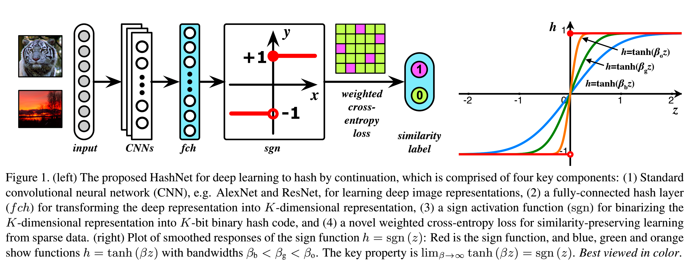

# 基于 PaddlePaddle 实现 HashNet(ICCV2017)

简体中文

## 一、简介

对于大规模的最近邻搜索问题，比如**图像检索 Deep Hashing**等，哈希学习被广泛应用。然而现有基于深度学习的哈希学习方法需要先学习一个连续表征，再通过单独的二值化来生成二进制的哈希编码，这导致检索质量严重下降。HashNet则提出了两点改进方式：1. 针对不平衡分布的数据做了一个均衡化；2. 针对符号激活进行了改进，即让激活函数 $h=tanh(\beta z)$ 中的 $\beta$ 在训练过程中不断变化最终逼近1。下图展示了 HashNet 的主要架构。

<p align="center">

    <h4 align="center">HashNet 架构</h4>
</p>


## 二、数据集

MS COCO（即 [COCO2014](https://cocodataset.org) ）

- COCO2014 是一个图像识别、分割和字幕数据集。它包含 82,783 张训练图像和 40,504 张验证图像，共 80 个类别。

- 对其中没有类别信息的图像进行剪枝后，将训练图像和验证图像相结合，得到 122218 张图像。然后随机抽取 5000 张图像作为查询集，其余用作数据库；此外,从数据库中随机抽取 10,000 张图像作为训练集。数据集处理代码详见 [utils/datasets.py](utils/datasets.py)。另外数据集分割好的list放在 [./data/coco/](./data/coco/) 路径下。

- 需要**注意**的是：通过对比发现，原作者的list与第三方参考代码 [DeepHash-pytorch](https://github.com/swuxyj/DeepHash-pytorch) 中的list略有不同，不过经过测试，两种list最终跑出来精度差不多。本项目复现的时候采用与原作者一样的list。


## 三、快速开始

```shell
sh scripts/test_single_gpu.sh
```

```shell
sh scripts/train_single_gpu.sh
```

